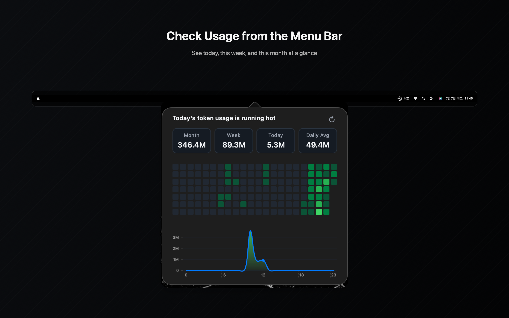
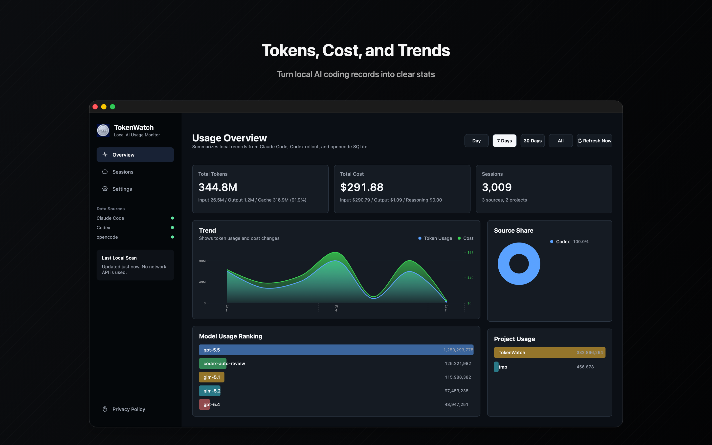
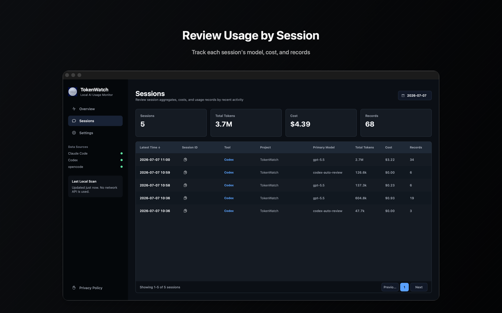

# TokenWatch

[](https://github.com/OrrHsiao/TokenWatch/actions/workflows/ci.yml)
[](./LICENSE)


[English](./README.md) | [简体中文](./README.zh-CN.md)

TokenWatch is a native macOS app for tracking token usage and estimated cost from local coding-agent data. It reads local usage records from Claude Code, Codex, and opencode, then summarizes totals by day, month, model, project, and provider.

The app is built with Swift, AppKit, and the macOS App Sandbox. TokenWatch does not send your usage data anywhere.

## Screenshots

<p align="center">
  
</p>

<p align="center">
  
</p>

<p align="center">
  
</p>

## Features

- Native macOS menu bar and window experience
- Total usage, today, recent 30 days, and recent 12 months views
- Token and cost breakdowns by provider and model
- Calendar heatmap and chart views for trend scanning
- Session-level review with model, project, token, cost, and record counts
- Local parsing for Claude Code JSONL, Codex rollout JSONL, and opencode SQLite data
- Security-scoped bookmark access for sandbox-friendly local file permissions
- Embedded LiteLLM pricing snapshot with hand-tuned pricing overrides for common models

## Supported Sources

| Source | Local data read by TokenWatch | Notes |
| --- | --- | --- |
| Claude Code | `~/.claude/projects/**/*.jsonl` | Deduplicates by `message.id`, with `requestId` as an optional suffix. |
| Codex | `~/.codex/sessions/**/rollout-*.jsonl` and archived sessions | Uses `last_token_usage` when available, otherwise derives deltas from total token counts. |
| opencode | `~/.local/share/opencode/opencode.db` | Reads assistant messages from SQLite in read-only mode and preserves upstream cost when present. |

## Privacy

TokenWatch is designed as a local-only utility.

- It reads files only after you grant access through the macOS open panel.
- It stores security-scoped bookmarks in `UserDefaults` so the app can reopen the same local folders later.
- It does not upload usage records, project paths, prompts, responses, or pricing data.
- It does not include analytics or telemetry.

The app may display local project paths from the agent logs because those paths are part of the source data.

## Install

Download the latest packaged app from the [GitHub Releases page](https://github.com/OrrHsiao/TokenWatch/releases):

1. Download `TokenWatch-macOS-universal.zip` from the latest release.
2. Unzip the archive.
3. Move `TokenWatch.app` to `/Applications`.
4. Open TokenWatch and authorize access to your user directory when prompted.

If macOS says `TokenWatch.app is damaged and can't be opened. You should move it to the Trash.`, confirm that the app came from the official TokenWatch release page, then go to **System Settings > Privacy & Security**. In the Security section, click **Open Anyway** for TokenWatch, then open TokenWatch again and choose **Open** when prompted.

To build from source instead:

1. Clone the repository.
2. Open `TokenWatch.xcodeproj` in Xcode.
3. Select the `TokenWatch` scheme.
4. Build and run on macOS.
5. In the app, open settings and authorize access to your user directory when prompted.

## First Run

TokenWatch asks for user-directory access once, then scans supported provider folders under your home directory. If you do not use one of the supported tools, that provider will simply have no data.

You can refresh manually from the window or menu bar popover. Automatic refresh intervals can be changed in settings.

## Build

Requirements:

- macOS 15.0+
- Xcode 16.4+
- Swift 6.0

Build the app:

```bash
xcodebuild -project TokenWatch.xcodeproj -scheme TokenWatch -configuration Debug build
```

Run unit tests:

```bash
xcodebuild -project TokenWatch.xcodeproj -scheme TokenWatch -destination 'platform=macOS' -only-testing:TokenWatchTests test
```

Run all tests:

```bash
xcodebuild -project TokenWatch.xcodeproj -scheme TokenWatch -destination 'platform=macOS' test
```

## Architecture

Each provider owns its scanner and parser, then emits shared `ParsedUsageEntry` values. `PricingEngine` and `UsageAggregator` turn those entries into summaries that are rendered by AppKit view controllers.

```text
Provider scanner/parser
        |
        v
ParsedUsageEntry
        |
        v
PricingEngine + UsageAggregator
        |
        v
TokenStatsViewModel
        |
        v
AppKit sidebar, charts, menu bar popover
```

Key directories:

```text
TokenWatch/
  Analytics/       Aggregation logic
  Models/          Shared usage and pricing models
  Pricing/         Pricing table, LiteLLM catalog, cost engine
  Providers/       Claude Code, Codex, and opencode adapters
  Services/        Security-scoped bookmark management
  ViewControllers/ AppKit UI
  ViewModels/      Provider state coordination

TokenWatchTests/   Swift Testing unit tests
TokenWatchUITests/ XCTest UI tests
```

## Pricing Data

TokenWatch estimates cost from embedded pricing data. Prices can drift from upstream provider billing, so treat app totals as an estimate rather than an invoice. Unknown models fall back to upstream cost when the source provides it; otherwise their cost may be shown as zero until pricing data is updated.

## Contributing

Issues and pull requests are welcome. Please keep changes focused and include tests for parser, pricing, aggregation, or UI behavior when relevant.

For local agent guidance, see [AGENT_GUIDE.md](./AGENT_GUIDE.md).

## License

TokenWatch is licensed under the GNU General Public License v3.0 or later. See [LICENSE](./LICENSE).
