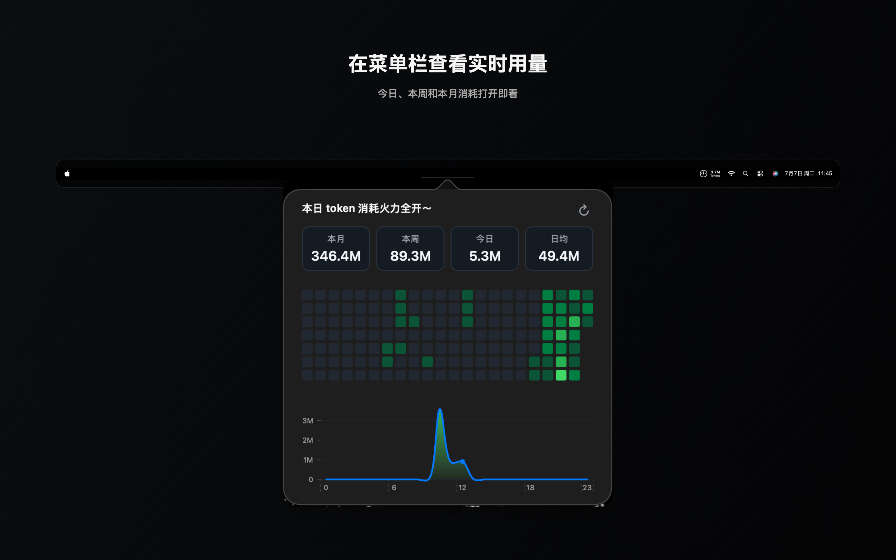
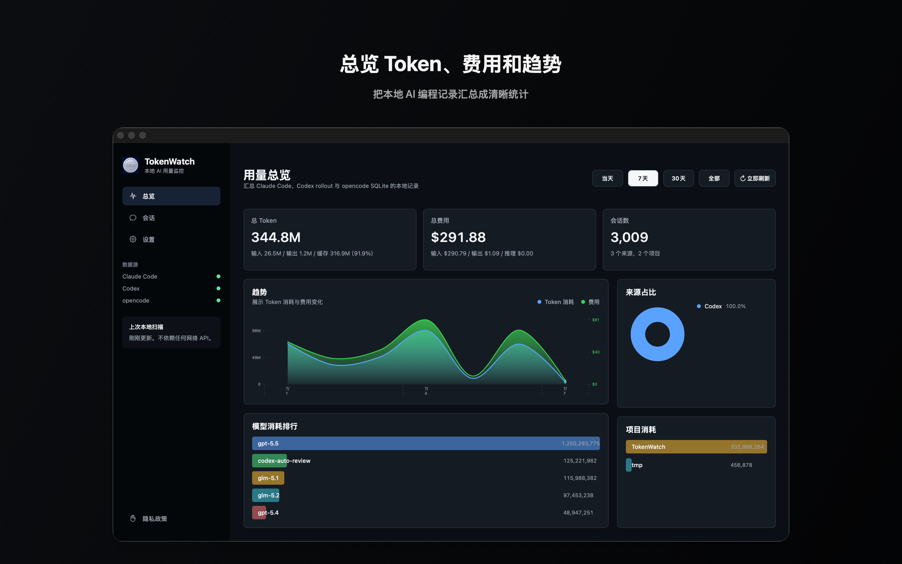
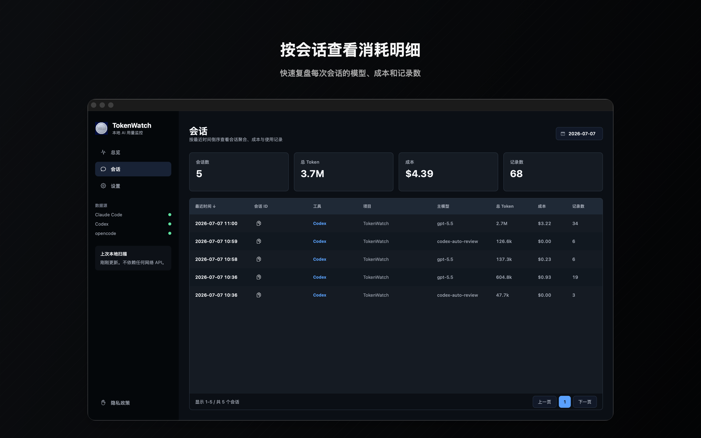

# AI Token Watch

[English](./README.md) | [简体中文](./README.zh-CN.md)

[](https://github.com/OrrHsiao/TokenWatch/actions/workflows/ci.yml)
[](./LICENSE)


AI Token Watch 是一个原生 macOS 应用，用于从本地 coding agent 数据中统计 token 用量和预估费用。它会读取 Claude Code、Codex 和 opencode 的本地使用记录，并按日期、月份、模型、项目和 provider 汇总数据。

应用使用 Swift、AppKit 和 macOS App Sandbox 构建。AI Token Watch 不会把你的使用数据发送到任何地方。

## 截图

<p align="center">
  
</p>

<p align="center">
  
</p>

<p align="center">
  
</p>

## 功能

- 原生 macOS 菜单栏和窗口体验
- 总计、今日、最近 30 天、最近 12 个月视图
- 按 provider 和模型拆分 token 用量与费用
- 日历热力图和图表视图，方便快速查看趋势
- 按 session 查看模型、项目、token、费用和记录数
- 本地解析 Claude Code JSONL、Codex rollout JSONL 和 opencode SQLite 数据
- 使用 security-scoped bookmark 适配沙盒环境下的本地文件授权
- 内置 LiteLLM 价格快照，并对常用模型做了手动价格修正

## 支持的数据源

AI Token Watch 启动时绝不会自动打开文件选择器。请在**设置**的**数据文件夹**区域中，只选择你实际使用的数据源。

| 数据源 | 用户选择的文件夹 | 在该文件夹内读取的数据 |
| --- | --- | --- |
| Claude Code | Claude Code 数据文件夹 | `projects/**/*.jsonl` |
| Codex | Codex 数据文件夹 | `sessions/**/rollout-*.jsonl`、`archived_sessions/**` 和可选的 `config.toml` |
| opencode | opencode 数据文件夹 | `opencode.db` |

每个数据源分别保存一个只读 security-scoped bookmark。某个数据源未选择，不会阻止其他已选择的数据源工作。

## 隐私

AI Token Watch 被设计为只在本地运行的工具。

- 只有在你通过标准 macOS 打开面板明确选择某个数据源文件夹后，它才会读取该文件夹。
- 它会在 `UserDefaults` 中为每个已选择的数据源分别保存 security-scoped bookmark，便于下次重新打开同一文件夹。
- 它不会上传使用记录、项目路径、prompt、response 或价格数据。
- 它不包含 analytics 或 telemetry。

由于本地 agent 日志中本身可能包含项目路径，应用界面里也可能展示这些本地路径。详见[隐私政策](https://orrhsiao.github.io/TokenWatch/privacy/)。

## 安装

推荐从 [GitHub Releases 页面](https://github.com/OrrHsiao/TokenWatch/releases) 下载最新安装包：

1. 在最新 release 中下载 `AI-Token-Watch-macOS-universal.zip`。
2. 解压压缩包。
3. 将 `AI Token Watch.app` 移动到 `/Applications`。
4. 打开 AI Token Watch；启动过程不会弹出文件选择器。
5. 打开**设置**，在**数据文件夹**区域为你使用的每个数据源选择文件夹。

如果 macOS 提示 `AI Token Watch.app 已损坏，无法打开。你应该将它移到废纸篓。`，请先确认应用来自官方 AI Token Watch release 页面，然后打开 **系统设置 > 隐私与安全性**。在“安全性”区域为 AI Token Watch 点击“仍要打开”，之后重新打开 AI Token Watch，并在提示时选择“打开”。

如果你想从源码构建：

1. Clone 本仓库。
2. 用 Xcode 打开 `TokenWatch.xcodeproj`。
3. 选择 `TokenWatch` scheme。
4. 在 macOS 上构建并运行。
5. 打开**设置**，在**数据文件夹**区域选择数据源文件夹。

## 首次运行

AI Token Watch 启动时不会请求文件访问权限。请打开**设置**，找到**数据文件夹**，通过标准 macOS 文件夹选择器选择各数据源的数据文件夹。取消选择不会改变该数据源已有的文件夹或数据。

已选择的数据源会独立加载。未选择的数据源会显示尚未选择文件夹；已选择但为空的文件夹会显示未发现数据。你可以在主窗口或菜单栏弹窗里手动刷新，也可以在设置中调整自动刷新间隔。

## 构建

要求：

- macOS 15.0+
- Xcode 16.4+
- Swift 6.0

构建应用：

```bash
xcodebuild -project TokenWatch.xcodeproj -scheme TokenWatch -configuration Debug build
```

运行单元测试：

```bash
xcodebuild -project TokenWatch.xcodeproj -scheme TokenWatch -destination 'platform=macOS' -only-testing:TokenWatchTests test
```

运行全部测试：

```bash
xcodebuild -project TokenWatch.xcodeproj -scheme TokenWatch -destination 'platform=macOS' test
```

## 架构

每个 provider 都拥有自己的 scanner、parser、所选数据根契约和只读 security-scoped bookmark，然后输出统一的 `ParsedUsageEntry`。`PricingEngine` 和 `UsageAggregator` 会把这些 entry 汇总成统计结果，再由 AppKit view controller 渲染。`TokenStatsViewModel` 会让各 provider 的授权和加载状态保持独立。

```text
Provider scanner/parser
        |
        v
ParsedUsageEntry
        |
        v
PricingEngine + UsageAggregator
        |
        v
TokenStatsViewModel
        |
        v
AppKit sidebar, charts, menu bar popover
```

关键目录：

```text
TokenWatch/
  Analytics/       汇总逻辑
  Models/          共享的用量和价格模型
  Pricing/         价格表、LiteLLM catalog 和费用计算
  Providers/       Claude Code、Codex 和 opencode 适配器
  Services/        Security-scoped bookmark 管理
  ViewControllers/ AppKit UI
  ViewModels/      Provider 状态协调

TokenWatchTests/   Swift Testing 单元测试
TokenWatchUITests/ XCTest UI 测试
```

## 价格数据

AI Token Watch 使用内置价格数据预估费用。价格可能和上游 provider 的实际账单存在差异，因此应用里的总额应视为估算值，而不是正式账单。未知模型会优先使用数据源自带的上游费用；如果源数据没有费用，费用可能会显示为零，直到价格数据被更新。

## 贡献

欢迎提交 issue 和 pull request。请尽量保持改动聚焦；如果涉及 parser、价格、聚合或 UI 行为，请补充相应测试。

本仓库的本地 agent 协作规则见 [AGENT_GUIDE.md](./AGENT_GUIDE.md)。

## 许可证

AI Token Watch 使用 GNU General Public License v3.0 or later 授权。详见 [LICENSE](./LICENSE)。
