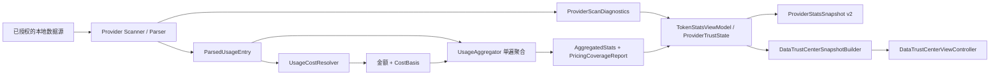

# TokenWatch 数据可信度中心详细设计

**日期**：2026-08-11

**状态**：已确认，待实施

**确认日期**：2026-08-28

**最后复核基线**：TokenWatch 1.0.6；已纳入 2026-08-25 定价表更新

**优先级**：P0-1

**平台**：macOS 15+，原生 AppKit

**关联路线图**：[TokenWatch P0 功能路线图](../plans/2026-08-11-p0-feature-roadmap.md)

**实施计划**：[数据可信度中心实施计划](../plans/2026-08-28-data-trust-center.md)

## 一、背景

TokenWatch 已能从 Claude Code、Codex CLI 和 opencode 的本地数据中计算 Token 与费用，但目前 UI 主要回答“用了多少”，还不能可靠回答“这个数字为什么值得相信”。

现有链路具备 last-good、来源 revision、统计快照和离线价格表等正确性基础，却有以下产品断层：

1. Provider 的完整性信号大多只写入日志，`UsageProviderLoadResult` 无法表达某个源被跳过、沿用 last-good 或有 usage-like 记录解析失败。
2. `lastRefreshedAt` 在失败路径也会被更新，旧统计可能被展示成“刚刚刷新”。
3. 未知模型与真实 `$0` 都落成费用 `0`，用户无法判断费用是否漏算。
4. 聚合快照没有 parser、聚合与价格表的 pipeline revision；App 更新计价规则后，源文件未变化时可能继续复用旧费用。
5. Dashboard 的模型排行没有跟随所选时间范围；“会话”卡实际展示记录数；输入/输出/推理费用按 Token 比例反推，属于无法成立的伪精确。
6. 隐私政策只描述偏好和 Bookmark，但实现还会落盘增量解析缓存、Provider 聚合快照和 App Group Widget 快照。部分增量状态包含原始 tail/continuity bytes，披露与实现必须对齐。

因此，“数据可信度中心”不是增加一个健康分数页面，而是把已有扫描、回退、计价和缓存语义升级为可测试的产品契约。

## 二、目标与成功标准

### 目标

1. 让用户区分 Token 读取是否可靠、费用是否覆盖、数据是否新鲜，这三件事互不混淆。
2. 明确当前统计来自本轮扫描、正常缓存命中、last-good、内存旧结果还是磁盘汇总快照。
3. 把未知模型从 `$0` 中分离，解释上游报告费用与本地估算费用的来源。
4. 在部分故障时继续展示可用结果，同时明确影响范围和生成时间。
5. 全程保持默认本地处理，不增加遥测、上传或运行时价格联网。
6. 建立 P0-2 会话定位、P0-3 预算预测、P0-4 提醒和 P0-5 数据清理可以复用的可信契约。

### 成功标准

用户进入页面后，应在 10 秒内回答：

- 哪个 Provider 正常、未接入、受限或正在使用旧结果？
- Token 汇总是否有已知缺失，缺失来自哪里？
- 费用覆盖了多少 Token/记录，哪些模型尚未计价？
- 最近一次尝试、成功和完整成功分别是什么时间？
- 当前最合适的修复动作是什么？

### 产品原则

- **事实优先于分数**：不提供“可信度 92 分”等难以审计的综合分。
- **Token 与费用分轴**：未知价格不等于 Token 读取失败；解析失败也不等于已读取记录的价格错误。
- **旧数据可用但必须标旧**：降级不清空 UI，也不能伪装为新鲜结果。
- **正常过滤不是错误**：非 assistant 行、零 Token 行、重复记录和已知 replay 抑制只做信息计数。
- **无法观测就显示未知**：Provider 暂时不能提供的计数使用 `nil/未知`，不能伪装成 `0`。
- **诊断最小化**：持久化诊断只保存稳定代码、计数、时间和价格匹配信息，不保存原始内容或路径。

## 三、明确不做

- 不做任意权重的综合可信度分数。
- 不读取或展示 prompt、response、原始 JSON/JSONL/SQLite 行。
- 不做“原始日志查看器”、完整路径查看器或诊断包上传。
- 不把估算费用宣传成供应商账单，也不做账单对账。
- 不联网更新价格，不支持自定义价格、多币种或新增 Provider。
- 不在本功能发送系统通知；通知属于 P0-4。
- 不在本功能提供断开、全部清除等破坏性数据操作；完整管理界面属于 P0-5。
- 不重写现有 parser、去重或 ccusage 对齐算法；本轮只为其增加结构化诊断，并修复明确的展示/缓存正确性问题。
- 不在本轮重做整个 Dashboard 的 RTL；新页面使用 natural alignment 与 leading/trailing，既有页面的强制 LTR 另行治理。

## 四、可信度定义

“完整”只表示：在用户已授权的数据根内，TokenWatch 当前支持的文件/表结构与 billing record 范围中，本轮没有观察到源读取失败、usage 候选异常拒绝或旧结果回退。它不承诺上游工具一定写出了所有请求，也不承诺等同供应商账单。

可信度拆成三个独立轴：

| 轴 | 回答的问题 | 主要事实 | 不应推导的结论 |
|---|---|---|---|
| 数据读取 | 支持范围内的数据是否被当前扫描可靠读取？ | 授权、目录结构、源发现/读取、last-good、跳过、异常拒绝、去重 | 不能证明上游从未漏写日志 |
| 费用估算 | 已读取用量中有多少能得到可信费用来源？ | 上游费用、本地价格命中、未计价 Token/记录、未知模型 | 不能声称等同最终账单 |
| 数据新鲜度 | 当前展示结果是否经过最近检查？ | 尝试时间、成功时间、完整成功时间、显示数据生成时间、数据来源 | 不能用失败尝试时间冒充成功时间 |

## 五、信息架构与交互

### 导航与入口

- 在侧边栏“会话”和“设置”之间新增短标题 **数据质量**，图标使用 `checkmark.shield`。
- 页面标题使用 **数据可信度中心**，避免侧边栏长文案挤压 65 种语言布局。
- 数据可信度属于基础数据解释能力，始终免费可用，不受 Widget 永久解锁 entitlement 限制。
- 现有侧边栏“数据源”状态行和“上次本地扫描”区域继续保留；点击后进入可信度中心并定位对应 Provider。
- 入口状态同时使用图标、文字和颜色，不能只有红/黄/绿点。
- 进入页面不得自动弹出目录选择器。授权动作统一跳转设置或显式点击“管理文件夹”，延续现有隐私边界。

### 页面结构

页面使用与总览一致的 `NSScrollView + NSStackView + glass card`，但由独立 `DataTrustCenterViewController` 管理，避免继续扩张 `DashboardViewController`。

1. **页头**
   - 标题与“所有检查均在本机完成”的副标题。
   - “立即检查”按钮。
   - 最近一次完整成功扫描的绝对时间。
   - 扫描中保留上一轮内容，仅增加 spinner 和“正在检查”。
2. **总体结论**
   - 数据读取：正常 / 使用旧结果 / 有已知缺失 / 受限 / 无数据。
   - 费用估算：覆盖完整 / 部分未计价 / 覆盖未知 / 无可计价数据。
   - 数据新鲜度：当前 / 过期 / 最近检查失败 / 从未成功 / 手动检查模式。
   - 一句自然语言摘要，例如：“Token 统计已更新；2 个未知模型影响 3.1% Token 的费用估算。”
3. **需要处理的问题**
   - 仅在有问题时展示，按严重度、Provider 固定顺序和问题代码稳定排序。
   - 每条包含影响、事实和单一主要动作，不展示底层 error description。
4. **数据来源**
   - 每个 Provider 一张可展开卡。
   - 展示授权/目录状态、时间、当前数据来源、源读取计数、记录处理计数、费用覆盖和动作。
   - 不展示完整目录路径、session/message/request ID。
5. **费用可信度**
   - Token 覆盖率为主指标，记录覆盖率为辅助指标。
   - 成本来源拆分为“上游报告 / 本地内置价格 / 未计价”。
   - 未知模型表展示 Provider、模型、记录数、Token 数、首次/最近出现时间。
   - 明示“费用为估算，不是账单；本地价格随 App 内置，不会在线更新”。
6. **本地处理说明**
   - App Sandbox、用户选择文件夹只读、本机解析、App Group 仅与自带 Widget 共享裁剪快照。
   - 提供“查看隐私政策”和“前往设置管理数据源”。
   - 清除/断开入口留给 P0-5。

### Provider 卡字段

| 分组 | 字段 | 展示规则 |
|---|---|---|
| 连接 | 授权、目录结构 | 未接入为灰色中性；失去访问或目录结构错误为受限 |
| 时间 | 上次尝试、上次成功、上次完整成功 | 时间含义分开，不使用一个模糊“上次刷新” |
| 来源 | 当前扫描、已验证未变化、last-good、内存旧结果、磁盘汇总快照 | 正常 cache hit 等同当前已验证；last-good 必须橙色标识 |
| 扫描 | 发现源、当前读取/验证、last-good、无回退跳过 | JSONL 的源为文件；opencode 的源为数据库，候选行归入解析字段，标签按 Provider 本地化 |
| 解析 | usage 候选、接受、正常过滤、异常拒绝、去重 | 无法观测的字段显示“未知”，不显示 0 |
| 费用 | Token/记录覆盖率、来源拆分、未知模型 | `$0` 不作为覆盖判断依据 |
| 动作 | 重新检查、前往设置 | 不自动触发授权，不提供原始日志查看 |

### 空态与加载态

- **所有 Provider 未接入**：总体状态为“尚未接入数据源”，主动作“前往设置”。
- **单个 Provider 未接入**：中性，不降低其他已接入 Provider 的结论。
- **目录有效且干净扫描为零记录**：显示“未发现用量”，既不标正常也不标错误；如果这是唯一已接入源，总体状态为“无数据”。
- **首次加载**：无旧内容时展示 skeleton/spinner；有旧内容时保留旧内容并标“正在检查”。
- **全部失败且无旧结果**：显示“受限”，提供重新检查与设置入口。
- **全部失败但有聚合快照**：继续显示汇总，明确“来自本地汇总快照”；会话明细不可用，不能声称完整。

## 六、状态模型与优先级

### 总体状态

总体结论只聚合已接入 Provider，顺序如下：

1. 没有已接入 Provider：`setupRequired`。
2. 已接入 Provider 正在首次检查且无可用结果：`checking`。
3. 任一已接入 Provider 无当前或旧结果且无法读取，或启动迁移无法清理遗留原字节/明文根缓存：`limited`。
4. 任一 Provider 使用 last-good/旧汇总、存在源被跳过、异常 usage 候选、扫描/费用诊断未知、费用未覆盖、其他本地汇总持久化失败或数据过期：`attention`。
5. 已接入 Provider 都是干净扫描但没有记录：`noData`。
6. 其余为 `healthy`。

`isChecking` 是正交状态：刷新期间保留刷新前的 `healthy/attention/limited/noData` 结论，并附加进度；只有首次无结果时才单独显示 `checking`。

### 三轴可执行结论

页面的三轴不是文案别名，而是由同一份事实模型独立派生的稳定枚举：

    enum DataReadingConclusion: String, Codable, Sendable {
        case setupRequired
        case checking
        case complete
        case usingOldData
        case knownMissing
        case limited
        case noData
        case unknown
    }

    enum PricingConclusion: String, Codable, Sendable {
        case complete
        case partial
        case unavailable
        case noPricableData
    }

    enum FreshnessConclusion: String, Codable, Sendable {
        case current
        case stale
        case lastCheckFailed
        case neverSucceeded
        case manualRefreshOnly
    }

数据读取结论按以下顺序派生：

1. 没有已接入 Provider → setupRequired。
2. 首次检查中且没有当前或旧结果 → checking。
3. 任一已接入 Provider 最近一次 attempt 失败且没有当前或旧结果 → limited。
4. 任一已接入 Provider 有无回退源跳过 → knownMissing。
5. 任一已接入 Provider 使用 last-good、内存旧结果或磁盘汇总快照 → usingOldData。
6. 已接入 Provider 的诊断不可用 → unknown。
7. 所有已接入 Provider 完整成功但没有记录 → noData。
8. 其余 → complete。

费用结论只针对“已经读取的数据”，不得反向改变数据读取结论：

1. 已接入 Provider 没有可计价 Token → noPricableData。
2. 任一已接入 Provider coverage 不可用，或只有非法/过期费用且无法回退到有效本地价格 → unavailable。
3. 存在未计价 Token/记录 → partial。
4. 其余 → complete。

新鲜度结论按以下顺序派生：

1. 最近一次 attempt 失败 → lastCheckFailed。
2. `lastSuccessfulScanAt == nil` → neverSucceeded；是否正在首次检查由正交的 isChecking/读取 checking 表达。
3. 自动刷新关闭且曾成功 → manualRefreshOnly；展示成功时间，但不声称“当前”。
4. 自动刷新开启、App active 且超过过期阈值 → stale。
5. 其余 → current。

总体状态只汇总三轴严重度：读取 limited 或 `legacyCacheCleanupFailed` 产生总体 limited；读取 usingOldData/knownMissing/unknown、费用 partial/unavailable、新鲜度 stale/lastCheckFailed 或其他本地持久化 issue 产生 attention；只有读取 complete/noData、费用 complete/noPricableData、且新鲜度 current/manualRefreshOnly 时才为 healthy。手动检查模式是健康的事实状态，但 UI 必须明确它不会自动保持新鲜。

### Provider 扫描完整性

```swift
enum ProviderScanCompleteness: String, Codable, Sendable {
    case unavailable   // 诊断未接入，或缺少可兼容复用的完整 parse report
    case complete      // 干净完成，允许更新“上次完整成功”
    case degraded      // 使用 last-good 或拒绝少量 usage 候选，结果仍可用
    case incomplete    // 有源无回退被跳过，已知缺数
    case failed        // 当前扫描无法生成可用结果
}
```

完整性由稳定事实派生，不由 Provider 自行给 UI 文案：

- 最近一次 `lastAttemptOutcome` 为 failed → `failed`；是否仍展示旧数据由 `displayedDataOrigin` 单独决定。
- `ProviderScanDiagnosticsState.unavailable`，或 `parse == nil` 且无法从兼容 v2 快照补回 → `unavailable`。
- `sourceSkippedWithoutFallbackCount > 0` → `incomplete`。
- `sourceUsingLastGoodCount > 0` 或 `parse.rejectedUsageRecords` 计数合计大于 0 → `degraded`。
- 其余成功扫描 → `complete`。
- 正常缓存命中、非 assistant、零 Token、重复/replay 不降低完整性。

### 问题优先级

| 问题 | 总体表达 | 影响 | 主要动作 |
|---|---|---|---|
| 目录无法恢复或结构错误 | 受限 | 当前 Provider 无法读取 | 前往设置 |
| 全局扫描失败且无旧结果 | 受限 | Token 与费用均不可用 | 重新检查 |
| 全局扫描失败但保留旧结果 | 使用旧结果 | 当前变化未知 | 重新检查 |
| 文件读取失败并用 last-good | 使用旧结果 | 对应文件可能不是最新 | 重新检查 |
| 文件读取失败且无回退 | 有已知缺失 | Token 与费用均可能偏低 | 重新检查 |
| usage 候选格式异常 | 需关注 | 对应记录未计入 | 重新检查；持续存在时等待兼容更新 |
| 存在未计价模型 | 费用不完整 | Token 可信，费用可能偏低 | 查看费用说明 |
| 上游费用非法且无本地回退 | 费用不完整 | Token 可信，费用不可用 | 查看费用说明 |
| 本地限时价格已过期 | 费用不完整 | Token 可信，费用等待价格更新 | 查看费用说明 |
| 本地汇总快照写入失败 | 需关注 | 当前数据可用，但下次启动可能需要重扫 | 重新检查 |
| 本地汇总快照删除失败 | 需关注 | 已禁止复用旧快照，但需完成本地清理 | 重新检查 |
| 遗留缓存清理失败 | 受限 | 隐私迁移未完成，阻止本版本发布 | 退出并重新打开 App；持续存在则等待修复 |
| 自动刷新开启但明显过期 | 需关注 | 当前数据可能过时 | 立即检查 |
| Provider 未接入 | 未接入 | 不参与总体结论 | 仅在 Provider 卡展示 |

至少一个 Provider 已接入时，未接入 Provider 不进入“需要处理的问题”，也不产生 `directoryNotSelected` attention issue；只有全部未接入时才生成一条 `setupRequired` 总体动作“前往设置”。

### 新鲜度规则

- 自动刷新关闭时使用 `manualRefreshOnly`，只展示成功时间事实，不因时间流逝降低状态，也不声称数据“当前”。
- 自动刷新开启时，App 处于 active 且 `now - lastSuccessfulScanAt > max(2 × refreshInterval, 10 分钟)` 才标记过期。
- App 生命周期层监听 wake 与 didBecomeActive，先安排一次静默刷新；该刷新完成前不立即制造过期警告。
- 最近一次尝试失败时优先显示 `lastCheckFailed`，并按是否仍有旧结果进入 attention/limited。

## 七、领域模型

### 扫描诊断

```swift
enum ProviderScanDiagnosticsState: Codable, Sendable, Equatable {
    case unavailable
    case available(ProviderScanDiagnostics)
}

struct ProviderScanDiagnostics: Codable, Sendable, Equatable {
    let discoveredSourceCount: Int?
    let currentSourceCount: Int?
    let sourceUsingLastGoodCount: Int
    let sourceSkippedWithoutFallbackCount: Int
    let parse: ProviderParseDiagnostics?
}

struct ProviderParseDiagnostics: Codable, Sendable, Equatable {
    let usageCandidateCount: Int?
    let acceptedEntryCount: Int
    let duplicateEntryCount: Int
    let informationalDiagnostics: [DiagnosticCount]
    let expectedFilteredRecords: [DiagnosticCount]
    let rejectedUsageRecords: [DiagnosticCount]
}

struct DiagnosticCount: Codable, Sendable, Equatable {
    let code: DataDiagnosticCode
    let count: Int
}

enum DataDiagnosticCode: String, Codable, Sendable {
    // 不影响 Token 完整性的提示
    case modelInferredByFallback
    case unclassifiedInvalidJSONRow

    // 正常过滤
    case nonAssistantRecord
    case zeroUsageRecord
    case unsupportedNonUsageEvent

    // 会降低完整性的异常
    case malformedUsageRecord
    case invalidTimestamp
    case invalidTokenFields
    case missingRequiredMetadata
}
```

约束：

- `usageCandidateCount` 只统计已经被识别为计费用量候选的行/事件，不把普通 tool/user/metadata 行算作失败分母。
- `informationalDiagnostics`、`expectedFilteredRecords` 与 `rejectedUsageRecords` 分开保存，严重度由共享 builder 决定；源读取失败使用专用 source count，不重复塞入记录原因。
- 计数使用饱和加法；任何诊断都不参与 entry fingerprint 或 source revision，避免每次刷新被误判为源变化。
- `nil` 表示 Provider 无法观测，`0` 表示已观测且没有发生。
- `ProviderScanDiagnosticsState.unavailable` 只用于未接入诊断的测试替身/未来 Provider；三个生产 Provider 的成功 load 必须返回 `.available`。
- `parse == nil` 只允许在 `entries == nil` 的 verified-unchanged fast path：ViewModel 必须从相同 source/pipeline revision 的 v2 快照补回完整 parse report；若没有兼容快照，则本轮必须物化 candidates，不能把未知解析计数显示成 0。
- `ProviderScanDiagnosticsState` 与下文 `PricingCoverageState` 使用显式 `kind + payload` Codable，而不是依赖编译器合成形状，保证 v2 快照可审计。

### JSONL 当轮内部诊断

共享 coordinator 额外返回仅当轮、仅用于测试与安全日志的内部事实；它不进入 ProviderStatsSnapshot，也不参与 UI 严重度：

    struct JSONLCoordinatorRunDiagnostics: Sendable, Equatable {
        let memoryCacheHitCount: Int
        let diskCacheHitCount: Int
        let appendBuildCount: Int
        let rebuildCount: Int
        let restoredTailReplayCount: Int
        let prunedSourceCount: Int
    }

产品模型只接收 discovered/current/last-good/skipped 与解析计数。这样可以精确测试 coordinator 路径，又不会把实现细节固化成用户契约或持久化 schema。

### Provider 返回契约

保留现有协议形状，在 `UsageProviderLoadResult` 增加有默认值的诊断，降低测试替身迁移成本：

```swift
struct UsageProviderLoadResult: Sendable {
    let entries: [ParsedUsageEntry]?
    let didChange: Bool
    let sourceRevision: String?
    let diagnostics: ProviderScanDiagnosticsState

    init(
        entries: [ParsedUsageEntry]?,
        didChange: Bool,
        sourceRevision: String?,
        diagnostics: ProviderScanDiagnosticsState = .unavailable
    )
}
```

- 生产的 Claude、Codex、opencode 都必须提供诊断。
- 显式 initializer 用 `.unavailable` 默认值保持现有测试替身可编译；生产 Provider 不得依赖默认值。
- 即使 `entries == nil`（来源未变化并复用快照），也必须返回本轮 source check 事实；parse report 与价格覆盖从同 source/pipeline revision 的快照恢复。

### 单条费用解析

```swift
struct UsageCostResolution: Sendable, Equatable {
    let amountUSD: Double
    let basis: CostBasis
    let diagnostics: [PricingDiagnosticCode]
}

enum CostBasis: Sendable, Equatable {
    case upstreamReported
    case localEstimate(PricingMatch)
    case unavailable(candidates: [String])
}

struct PricingMatch: Sendable, Equatable {
    let requestedModelID: String
    let matchedModelID: String
    let baseCatalog: PricingCatalogSource
    let lookupKind: PricingLookupMatchKind
    let resolutionPath: PricingResolutionPath
    let adjustments: [PricingAdjustment]
    let validThrough: Date?
}

enum PricingCatalogSource: String, Codable, Sendable {
    case bundledLiteLLM
    case builtinOverride
    case bundledModelsDev
}

enum PricingLookupMatchKind: String, Codable, Sendable {
    case exact
    case normalizedBoundary
}

enum PricingResolutionPath: String, Codable, Sendable {
    case direct
    case explicitAlias
    case openCodeProviderCandidate
}

struct PricingAdjustment: Codable, Sendable, Equatable {
    let kind: PricingAdjustmentKind
    let detail: String?
}

enum PricingAdjustmentKind: String, Codable, Sendable {
    case builtinOverride
    case explicitAlias
    case normalizedBoundary
    case longContextOverlay
    case fastMultiplier
    case serviceTier
    case autoReviewDateMapping
    case openCodeProviderCandidate
}

enum PricingDiagnosticCode: String, Codable, Sendable {
    case invalidUpstreamCost
    case expiredLocalPrice
}

struct PricingLookupResult: Sendable {
    let pricing: ModelPricing
    let matchedModelID: String
    let baseCatalog: PricingCatalogSource
    let lookupKind: PricingLookupMatchKind
    let adjustments: [PricingAdjustment]
    let validThrough: Date?
}
```

`PricingAdjustment.detail` 只允许 canonical 模型 ID、catalog ID 或稳定 tier 代码，不接收任意 Provider 文本、路径或底层错误。`ParsedUsageEntry` 增加默认空数组 `pricingInputAdjustments`，只保存稳定调整代码与安全的模型 ID；Codex 将 `codex-auto-review` 的日期映射记录为 `.autoReviewDateMapping`，其他 Provider 默认空数组。Resolver 按“上游模型映射 → OpenCode candidate → alias/boundary → catalog/builtin → long-context → fast/service tier”的固定顺序合并为 `PricingMatch.adjustments`。这样最终匹配可解释，同时不保存原始事件或新增私有标识；该字段纳入 JSONL cache schema 与 pipeline revision。缺失字段按空数组解码以兼容 Claude/测试 fixture，但 Codex cache version 必须提升并重新从源派生历史 auto-review adjustment，不能把旧缓存的空数组当作完整 provenance。

`UsageCostResolver` 新增 `resolve(for:) -> UsageCostResolution`，旧 `resolvedCost(for:) -> Double` 暂时保留为兼容包装，返回 `resolve.amountUSD`。

费用来源规则：

1. 只有 `upstreamCost.isFinite && upstreamCost >= 0` 才返回 `.upstreamReported`；显式 `0` 仍算覆盖。
2. 非有限或负的 upstream cost 不丢弃 Token，记录 `invalidUpstreamCost` 后继续尝试本地价格；仍未命中时才返回 `.unavailable`。
3. 本地价格命中且仍在有效期内时返回 `.localEstimate`，金额继续遵守当前 provider/ccusage 语义。
4. 本地价格超过 `validThrough` 后不得继续算覆盖：记录 `expiredLocalPrice`，仅当更低优先级 catalog 有独立且仍有效的匹配时继续使用，否则返回 unavailable。限时价 2026-12-31 冻结为截止 `2027-01-01T00:00:00Z` 前有效，resolver 使用可注入时钟测试边界。
5. 没有合法 upstream 且所有候选都未命中有效价格时返回 `.unavailable`，金额仍为 `0`，但 UI 不再解释为免费。
6. OpenCode 继续保留“候选中正金额优先”的金额选择契约；OpenCode 源数据的 `cost <= 0` 仍按现有 adapter 规则转为 `nil`。如果所有有效本地命中候选金额都是 `0`，仍记录首个价格匹配作为已覆盖。
7. `PricingTable` 的内部 value 从裸 `ModelPricing` 升级为保留 base catalog、validThrough 与 adjustments 的分层条目，并提供 `lookup(_:) -> PricingLookupResult?`。builtin override、alias、boundary、long-context overlay、fast multiplier、service tier 与 OpenCode candidate 都必须可审计；UI P0 默认仍只展示“本地内置价格”。

### 费用覆盖报告

```swift
enum PricingCoverageState: Codable, Sendable, Equatable {
    case unavailable
    case available(PricingCoverageReport)
}

struct PricingCoverageReport: Codable, Sendable, Equatable {
    let totalEntries: Int
    let coveredEntries: Int
    let totalTokens: Int
    let coveredTokens: Int
    let upstreamEntries: Int
    let upstreamTokens: Int
    let locallyPricedEntries: Int
    let locallyPricedTokens: Int
    let unpricedEntries: Int
    let unpricedTokens: Int
    let unpricedModels: [UnpricedModelSummary]
    let omittedUnpricedModelCount: Int
}

struct UnpricedModelSummary: Codable, Sendable, Equatable {
    let providerID: ProviderID
    let modelID: String
    let reasons: [PricingUnavailabilityReason]
    let entryCount: Int
    let totalTokens: Int
    let firstSeenAt: Date?
    let lastSeenAt: Date?
}

enum PricingUnavailabilityReason: String, Codable, Sendable {
    case missingPrice
    case expiredLocalPrice
    case invalidUpstreamCostWithoutFallback
}
```

计算口径：

- Token 分母使用每条 `usage.aggregateTotalTokens`，它不重复计算 reasoning/cache creation。
- `tokenCoverage = coveredTokens / totalTokens`；`totalTokens == 0` 时显示“无可计价数据”，不显示 100%。
- 记录覆盖率作为辅助信息，避免一个超大未知模型记录被大量小记录掩盖。
- 覆盖率是“有费用来源的用量占比”，不是“已覆盖金额占比”；未知金额不能作为分母。
- 未计价模型按 `totalTokens` 降序、Provider 和模型 ID 稳定排序，持久化最多 50 项并记录省略项数量，防止异常模型 ID 造成无界快照。
- 模型 ID 可以展示；路径、会话和消息标识不进入报告。
- P0-1 的报告固定覆盖 Provider 授权根内的**全部已读取数据**，页面必须标注“全部数据”；它不跟随 Dashboard 的今日/7 日/30 日范围，范围化费用覆盖留给 P0-3。
- 多 Provider 总体报告对 `.available` 项做饱和求和，并按 `(providerID, modelID)` 合并未知模型、取最早/最晚时间后重新排序和截断；未接入 Provider 排除。任一已接入 Provider 为 `.unavailable` 时，总体只展示已知分项并标“覆盖状态未知”，不得据局部数据计算全局百分比。

### 聚合结果

```swift
struct UsageAggregationResult: Sendable {
    let stats: AggregatedStats
    let pricingCoverage: PricingCoverageState
}
```

`UsageAggregating` 增加 `aggregateWithDiagnostics`，默认实现可包装旧 `aggregate` 并返回 `.unavailable`；生产 `UsageAggregator` 覆写并在现有单次 entry 循环里同时累计统计和费用覆盖，不能为了页面再完整扫描一次 entries。

### ViewModel 可信状态

```swift
struct ProviderTrustState: Sendable {
    var dataRootIdentity: DataRootIdentityFingerprint?
    var lastAttemptStartedAt: Date?
    var lastAttemptFinishedAt: Date?
    var lastAttemptOutcome: ProviderAttemptOutcome?
    var lastSuccessfulScanAt: Date?
    var lastCompleteFreshScanAt: Date?
    var displayedStatsGeneratedAt: Date?
    var displayedDataOrigin: DisplayedDataOrigin
    var scan: ProviderScanDiagnosticsState
    var pricing: PricingCoverageState
    var localPersistenceIssue: LocalPersistenceIssue?
}

struct DataRootIdentityFingerprint: Codable, Sendable, Equatable {
    let sha256: String
}

enum ProviderAttemptOutcome: Codable, Sendable, Equatable {
    case succeeded
    case failed(ProviderRefreshFailureCode)
}

enum ProviderRefreshFailureCode: String, Codable, Sendable {
    case directoryAccessLost
    case invalidDirectoryStructure
    case sourceEnumerationFailed
    case databaseOpenFailed
    case databaseQueryFailed
    case unknownInternalFailure
}

enum DisplayedDataOrigin: String, Codable, Sendable {
    case currentScan
    case verifiedUnchanged
    case scanWithLastGood
    case retainedMemory
    case persistedSummarySnapshot
    case none
}

enum LocalPersistenceIssue: String, Sendable {
    case providerSnapshotWriteFailed
    case providerSnapshotDeleteFailed
    case legacyCacheCleanupFailed
}
```

DataRootIdentityFingerprint 固定组合 Provider ID、解析符号链接后的标准化路径、volume identifier 与根目录 file resource identifier，再按固定字段顺序做 SHA-256。资源标识必须通过可测试的稳定二进制归档进入摘要；任一标识缺失或无法稳定归档时 fingerprint 为 nil，该 Provider 仍可正常扫描，但冷启动失败时不得复用磁盘汇总快照。内存可信状态和 v2 快照保存同一摘要，用于识别“同一路径下目录已被替换”的情况；它是兼容性校验，不是加密边界。

时间更新契约：

- 每次开始/结束都更新 attempt 时间。
- attempt 结束必须写入结构化 `lastAttemptOutcome`；面向用户的状态不保存底层错误全文。
- 成功产出或验证可用统计时更新 `lastSuccessfulScanAt`。
- 只有最终 `ProviderScanCompleteness == .complete` 时才更新 `lastCompleteFreshScanAt`。
- 全局失败只更新 attempt 时间，绝不推进成功时间。
- 失败时保留上一次 `scan/pricing`，并把展示来源改为 `retainedMemory` 或 `persistedSummarySnapshot`；完整性先读取 attempt outcome，再读取保留的诊断。
- 重新聚合才更新 `displayedStatsGeneratedAt`；来源未变化只更新验证时间。
- 扫描失败时优先保留内存结果；冷启动无内存结果时可展示兼容的磁盘汇总快照，并标 `.persistedSummarySnapshot`。
- `ProviderState.lastRefreshedAt` 在所有 Dashboard/Popover 消费方迁移后移除；若实施期需要短暂兼容，只能作为 `lastSuccessfulScanAt` 的只读别名，失败路径不得写入。

## 八、Provider 诊断映射

### 共享 JSONL coordinator

`JSONLLastGoodCacheCoordinator` 已经知道每个文件走了内存命中、磁盘命中、重建、last-good 或首次失败跳过。返回结果增加本轮计数：

- 列出文件数。
- 当前成功读取或通过 identity/metadata 验证未变化的文件数。
- 正常内存/磁盘 cache hit 数，仅用于内部调试，不降低状态。
- 重新构建/追加文件数。
- 读取失败并使用 last-good 数。
- 读取失败且无 last-good 数。
- prune 数。

`onFailure` 继续用于日志，但产品状态只使用结构化代码与计数，不传播包含路径的 `Error.localizedDescription`。

为了让 unchanged cache hit 不重读源文件仍能恢复完整 parse report，Claude/Codex 的每文件增量 state 增加 `committedParseDiagnostics` 与 `provisionalParseDiagnostics`：

- committed diagnostics 与 stable candidates 一起持久化；provisional diagnostics 与 provisional tail 一样只留内存。
- append/rebuild 使用与 candidates 相同的提交边界迁移计数，不能把 provisional 行提前永久计入。
- source 有变化并物化 entries 时，在 projection/全局去重后重算 `acceptedEntryCount` 与 `duplicateEntryCount`。
- source 完全未变化且 `entries == nil` 时，ViewModel 只从 source/pipeline revision 同时匹配的 v2 快照复用上次全局 parse report；本轮 source check 事实仍来自 coordinator。
- 无兼容 v2 report 时强制物化 candidates，不能以全零诊断代替。
- parse diagnostics 不进入 `sourceRevisionComponent`，否则同一文件内容会因诊断 schema 变化产生假 source change。

### Claude

- 源单位：扫描到的 JSONL 文件。
- usage 候选：通过 pinned billing marker/shape guard 的记录。
- 正常过滤：非 usage 行、显式零用量、去重/sidechain replacement。
- 异常拒绝：usage-like 行 JSON 损坏、时间/Token/必要 billing 字段非法。
- 单文件失败按 coordinator 的 last-good/无回退计数。
- 项目路径启发式恢复不进入 P0 可信结论；避免把无法验证的 cwd 推断包装成数据完整性。

### Codex

- 源单位：sessions 与 archived_sessions 中的 rollout JSONL 文件。
- 正常过滤：非 token_count 事件、零增量、replay 抑制、全局重复。
- 异常拒绝：token_count 候选无法解码、时间非法、Token 字段非法。
- `codex-auto-review` 日期映射等模型 fallback 计数为提示项，不降低 Token 完整性，但会进入价格解释审计。
- speed/pricing scope 不匹配时不得使用 last-good，沿用现有缓存正确性契约。

### opencode

- 源单位：只读打开的 `opencode.db`；记录单位为 assistant message row。
- 当前 SQL 只能证明 `json_valid(data)` 且 `role=assistant` 的行是 assistant 候选；全表 invalid JSON 无法证明属于 usage，只能通过可选额外 COUNT 作为 informational/unknown，不能降低完整性。
- 已被 SQL 证明为 assistant 的行若在 Swift 解码失败、缺 tokens 或缺必填 SQLite 列，才归入异常拒绝；`notAssistant`、`allZero` 归入正常过滤。
- P0 不要求实现增量 SQLite revision；因此每次完整查询仍可标完整，只在性能说明中标“每次全量检查”。
- opencode 不伪造文件级 last-good 或 source skipped：这两个计数固定为 0。数据库打开/查询失败由 lastAttemptOutcome 表达，并按是否存在内存旧结果或兼容磁盘汇总显示 retained/persisted 来源。

## 九、快照与缓存迁移

### Provider 聚合快照 v2

`ProviderStatsSnapshot.currentSchemaVersion` 升到 2，并原子保存：

- `providerID`
- `stats`
- `generatedAt`
- `DataRootIdentityFingerprint`
- `timeZoneIdentifier`
- `sourceRevision`
- `pipelineRevision`
- 与 `stats` 相同 source/pipeline revision 的完整 `ProviderScanDiagnosticsState.available`；即使本轮为 degraded/incomplete 也必须保存原事实
- `PricingCoverageState`（生产成功快照必须为 `.available`）
- `lastSuccessfulScanAt`
- `lastCompleteFreshScanAt`

采用一个 v2 快照而不是拆成两个文件，确保统计金额、扫描事实和费用覆盖来自同一 source/pipeline revision。v1 是可重建派生缓存，首次检测到后删除并重新聚合，不做有风险的字段猜测迁移；即使本轮扫描随后失败，也不继续保留含明文数据根的 v1 文件。

v2 将现有明文 `dataRootPath` 改为 `DataRootIdentityFingerprint`：摘要同时包含 Provider、标准化解析后路径、volume identifier 与根目录 file resource identifier，避免“同一路径下目录已被替换”仍错误复用。任一资源 identity 无法稳定取得时不得冷启动复用快照。它只是兼容性校验和数据最小化措施，不是加密边界；`AggregatedStats` 的项目 breakdown 仍可能包含 cwd，因此隐私披露与 P0-5 清理范围不能缩小。

`ProviderStatsSnapshotStoring` 在 P0-1 增加 `remove(for:) throws`；切换新根时，在新根校验通过、扫描开始前清空该 Provider 的 entries/stats/trust/fingerprint/source revision，并删除旧快照。删除失败时禁止继续加载旧文件，设置 `providerSnapshotDeleteFailed`，但绝不删除 Bookmark 或外部源文件。P0-5 复用此内部 API 提供用户清理入口。

v1 聚合快照与旧 Claude/Codex 原字节缓存必须由启动迁移器主动清理，不依赖 Provider 是否仍授权。JSONL cache 先用只含 version 的 envelope 解码版本，再决定是否解码 State；不兼容、无法解码但可确认属于 TokenWatch 的派生缓存都删除。聚合快照和 JSONL store 均提供显式 remove API；清理失败设置 `legacyCacheCleanupFailed` 并阻止本版本发布，不能只写日志后宣称迁移完成。

### pipeline revision

`pipelineRevision` 是与产品数据口径相关的稳定摘要，至少覆盖：

- Provider parser/去重语义版本。
- 聚合与 Token 总量口径版本。
- `UsageCostResolver` 规则版本。
- LiteLLM 与 models.dev 两个 bundled artifact hash。
- canonical builtin price 全量序列化与 validThrough。
- alias、boundary/fuzzy、long-context overlay、fast multiplier、service tier、auto-review 和 OpenCode candidate 映射。
- `PricingEngine` 计价语义版本。

不能直接使用 App build/version，否则纯 UI 更新也会无意义地重算；也不能把扫描时间或诊断计数加入 revision。

实现上每一类硬编码规则提供 canonical serialization，和 parser/dedup/aggregation/resolver 版本常量、两个内置 catalog hash 一起按固定字段顺序生成 SHA-256。不能只靠一个宽泛的 resolver 版本人工承诺覆盖所有价格变化。catalog hash 不应在每次刷新时重新扫描资源；构建期/静态常量负责提供值，测试再用实际资源内容校验常量没有漂移。

快照复用必须同时满足：Provider、数据根、时区、source revision 和 pipeline revision 兼容。pipeline 不兼容时即使源文件没变也要物化 entries 并重新计价。

`sourceRevision == nil` 表示无法证明来源未变化：成功刷新仍执行完整读取与聚合，不走统计/费用快照 fast path；该快照只可在本轮读取失败时作为明确标旧的汇总回退。opencode 在引入稳定 revision 前保持这一语义。

### 冷启动失败

- 只有 Bookmark 成功恢复 security-scoped URL、`validateDataRoot` 通过，并且由该 URL 计算出的非 nil `DataRootIdentityFingerprint`、时区和 pipeline 都与快照兼容时，本轮扫描抛错才允许展示磁盘聚合快照。
- Bookmark 无法恢复、权限失效或目录结构错误时绝不加载快照，因为无法证明它属于用户当前授权的根；该 Provider 清空展示数据并进入受限状态。
- 用户选择新目录后先比较 identity fingerprint；根发生变化时按上面的 remove 契约先清空旧派生状态，再开始新扫描，绝不让旧根数据显示在新根名下。
- 因无法确认最新 source revision，来源必须标 `.persistedSummarySnapshot`，并显示快照生成时间与扫描错误。
- 聚合快照不含完整 entries，因此会话明细不可用；P0-2 必须读取该状态，不能用汇总推造会话。

## 十、可信口径前置修正

这些修正属于 P0-1 的第一实施阶段，先消除现有 UI 中与“可信”直接冲突的表达：

1. **模型排行跟随范围**
   - `DashboardRangeSnapshot` 从当前范围 bucket 的 `modelBreakdown` 构建 model rows。
   - `DashboardViewController` 不再使用 `TotalStatsBuilder.modelRows` 渲染选定范围。
2. **会话改为记录**
   - 当前卡片的值继续使用准确的 `entryCount`，标题改为“用量记录/记录数”。
   - 真正的唯一会话数、跨日会话规则和详情留给 P0-2，避免本轮引入不可恢复的快照口径。
3. **移除伪精确费用拆分**
   - 删除按 Token 占比将总费用反推为输入/输出/推理费用的展示。
   - 替换为“上游费用优先，其余按 App 内置价格估算”的来源说明，并提供数据质量入口。
   - 本轮不尝试把只有总额的 upstream cost 强行拆到 Token 类别。

## 十一、架构与数据流



职责边界：

- Provider 只报告事实，不决定总体颜色或用户文案。
- Cost resolver 决定单条金额和来源。
- Aggregator 单遍生成统计与覆盖率。
- ViewModel 管理尝试/成功时间、显示数据来源和快照生命周期。
- `DataTrustCenterSnapshotBuilder` 是纯函数，负责状态优先级、问题排序和展示 snapshot。
- `DataTrustCenterViewController` 只渲染 snapshot 与转发动作，不重新解释底层数据。

## 十二、错误与动作设计

UI 不直接展示底层 `localizedDescription`，因为 SQLite/文件错误可能包含完整路径。ViewModel 将错误归一化为稳定 issue code：

```swift
enum DataTrustIssueCode: String, Codable, Sendable {
    case directoryNotSelected
    case directoryAccessLost
    case invalidDirectoryStructure
    case refreshFailedNoData
    case refreshFailedUsingRetainedData
    case sourceUnreadableUsedLastGood
    case sourceUnreadableSkipped
    case malformedUsageRecords
    case pricingUnavailable
    case invalidUpstreamCost
    case expiredLocalPrice
    case localSnapshotWriteFailed
    case localSnapshotDeleteFailed
    case legacyCacheCleanupFailed
    case staleData
    case persistedSummaryOnly
}
```

错误详情仍可写入本地系统日志，但必须避免 raw line/prompt/response；面向用户的文案只包含 Provider、计数和安全动作。

`ProviderStatsSnapshot` 写入失败时设置仅驻内存的 `.providerSnapshotWriteFailed`，映射为 `localSnapshotWriteFailed`；它不降低本轮 Token/费用完整性，但让总体进入 attention。下一次原子写入成功后清除。不能尝试把“快照写入失败”持久化到同一个失败 store。

动作契约：

- “立即检查”：并发刷新所有已接入 Provider；未接入 Provider 不自动弹授权。
- “重新检查”：只刷新目标 Provider，复用现有 Provider load gate，禁止重复任务。
- “前往设置”：切换到设置页并聚焦对应 Provider 的目录卡。
- “查看费用说明”：页内定位费用可信度区域，不打开网络。
- 本轮不提供“重建索引”。如果未来加入，必须明确它会删除可重建缓存并立即从已授权原始日志重建，不等于隐私删除。

## 十三、隐私与数据生命周期

### 诊断最小化

`ProviderScanDiagnostics`、`PricingCoverageReport` 和 issue snapshot 禁止包含：

- 数据根或文件完整路径。
- prompt/response 或任意原始行片段。
- message ID、request ID、session ID、record UUID。
- cwd、项目完整路径。
- 未清洗的底层错误字符串。

允许包含：Provider ID、模型 ID、稳定问题代码、计数、时间、source/pipeline revision 和价格 catalog/match 元数据。

### 现有本地存储的真实边界

| 数据 | 现有内容 | P0-1 处理 |
|---|---|---|
| 外部 JSONL/SQLite | 原始日志与数据库 | 保持只读，TokenWatch 永不修改 |
| Bookmark/UserDefaults | 目录授权与偏好 | 继续现有行为，可信度中心只跳转管理 |
| 内存 entries/stats | session、模型、cwd、Token | 不新增持久化 |
| JSONL 增量缓存 | 解析 entry、路径 key、provisional tail、continuity bytes | 保留可重建 entry；阻止原始 tail/anchor bytes 继续直接落盘 |
| Provider 聚合快照 | session/project breakdown、数据根兼容信息 | 升级 v2，修订披露；诊断部分不再增加原始标识 |
| Widget 用量快照 | Token、费用、模型/项目显示信息 | 本轮只披露；P0-5 负责清除与 reload timeline |
| StoreKit entitlement | Widget 购买权益 | 与用量数据分离，任何后续清理都保留 |

### 原始增量字节最小化

P0-1 发布前必须消除“缓存直接复制原始内容”与隐私文案的冲突：

- continuity anchor 持久化 `offset + byteCount + SHA-256`，恢复时读取对应文件区间重新计算 hash；不保存原始 anchor bytes。
- provisional tail 不写入磁盘。磁盘状态保存 committed offset 和稳定 candidates；若保存时 `committedOffset < metadata.size`，恢复项必须标记为需要 tail replay，coordinator 不得把它当作完整 unchanged hit，而要从 committed offset 重新读取尾部。内存态仍可持有完成增量解析所需的短期 bytes。
- 不能只从现有 `CodingKeys` 删除字段后继续命中磁盘缓存；使用显式持久化 DTO，并保存 `requiresTailReplayOnRestore`。
- coordinator 的泛型接口增加 `requiresReplayAfterDiskRestore(State) -> Bool` 和 `JSONLStateBuildReason`。需要 replay 时既绕过 coordinator 的 exact metadata disk hit，也以 `.restoredTailReplay` 调用 parser build；parser 不得再走 `IncrementalJSONLTransition.reuse`。
- anchor 在内存与磁盘都只保留 digest。append/replay 时从已打开的同一 descriptor 读取固定区间，验证 digest，并用临时读取到的最多 1 KiB bytes 与新增提交字节计算下一 anchor；原始 bytes 不进入 state。
- `sourceRevisionComponent` 统一编码 `offset + byteCount + digest`，保证冷启动与热启动对同一源生成相同 revision。
- 旧磁盘缓存 schema 首次检测到后删除并重建，不迁移原始 byte 字段；删除只影响 TokenWatch 的可重建缓存，不触碰外部源文件。
- 用 fixture 断言磁盘 cache 编码不包含已知 prompt/response 片段，同时保持 append、truncate、replace 和 last-good 行为。

### 隐私政策修订

发布前同步修订中英文及站点隐私文案，准确说明：

- TokenWatch 不上传用量数据，也没有自建分析或遥测服务。
- App 在本机保存可重建增量缓存、聚合快照，并与自带 Widget 共享裁剪后的本地快照。
- 购买与恢复由 Apple StoreKit 处理；隐私/支持链接由默认浏览器打开，不能笼统声称“应用本身完全不访问网络”。
- 用户选择的数据目录以只读权限访问，原始日志不会被 TokenWatch 修改或删除。
- P0-5 上线前，清除能力的实际边界必须如实描述，不能提前承诺尚不存在的按钮。

## 十四、本地化、无障碍与布局

- 所有新增 `AppStringKey` 必须在现有全部语言资源中直接定义并通过 key/占位符一致性测试。
- 实施前先冻结新增 key 清单；每个 key 的 enum case、65 份资源、硬编码 key-count/英文复用 allowlist 更新和首次 UI 引用必须原子落在同一个可验证提交，不能留下中间必失败的本地化测试。Task A1 先加入并使用 `dataHealthPricingDisclaimer`，Task D2 再原子加入其余 90 项。
- 日期、数字和百分比使用 locale-aware formatter；文案使用格式占位符，避免字符串拼接破坏语序。
- 新页面使用 leading/trailing 与 natural text alignment。`DashboardViewController.render()` 不再对整个 root 递归 `enforceLeftAlignedContent`：该兼容逻辑只作用于既有 overview/session 等容器，必须跳过可信度 child root；可信度页按 `resolvedLanguage` 设置 LTR/RTL 方向。
- 状态使用图标、标题和解释三重表达，颜色只作辅助。
- 装饰状态点退出 accessibility tree；Provider 整行读成“Claude Code，使用旧结果，上次成功于……”
- 手动检查完成时只播报一次总体结论；静默自动刷新不打断 VoiceOver。
- 展开卡、问题行、未知模型表和操作按钮使用稳定 accessibility identifier。
- 所有按钮保留系统 focus ring、Tab 顺序和键盘激活。
- 以德语、法语、俄语、阿拉伯语等长文案做最小宽度 860pt 下的换行检查；本轮不宣称既有 Dashboard 已完整支持 RTL。

### 冻结的新增 AppStringKey

以下 91 个 key 是 P0-1 的完整新增清单。实施时不得临时改名、拆分或加入新的可见文案；确需变更必须先回写本设计。refreshNow、sidebarSettings、privacyPolicy、dashboardDataSources、settingsDirectoryNotSelected、settingsDirectorySelected、settingsDirectoryNeedsReselection 和 commonUnknown 继续复用现有 key，不重复新增。

| Key | English baseline | 简体中文基准 | Format signature |
|---|---|---|---|
| dataHealthNavigation | Data Quality | 数据质量 | — |
| dataHealthTitle | Data Trust Center | 数据可信度中心 | — |
| dataHealthSubtitle | Understand the completeness, cost coverage, and freshness of local usage data. | 了解本地用量数据的完整性、费用覆盖和新鲜度。 | — |
| dataHealthLastCompleteFormat | Last complete check: %@ | 上次完整检查：%@ | %@ |
| dataHealthNeverComplete | No complete check yet | 尚无完整检查 | — |
| dataHealthOverallTitle | Overall status | 总体结论 | — |
| dataHealthIssuesTitle | Needs attention | 需要处理的问题 | — |
| dataHealthNoIssues | No known issues | 没有已知问题 | — |
| dataHealthSourcesTitle | Data sources | 数据来源 | — |
| dataHealthPricingTitle | Cost coverage | 费用可信度 | — |
| dataHealthPrivacyTitle | Local processing | 本地处理说明 | — |
| dataHealthAllDataScope | All locally read data | 全部已读取本地数据 | — |
| dataHealthReadingAxisTitle | Data reading | 数据读取 | — |
| dataHealthPricingAxisTitle | Cost estimate | 费用估算 | — |
| dataHealthFreshnessAxisTitle | Freshness | 数据新鲜度 | — |
| dataHealthReadingSetupRequired | Set up a data source | 尚未接入数据源 | — |
| dataHealthReadingChecking | Checking for the first time | 正在首次检查 | — |
| dataHealthReadingComplete | Complete within supported data | 支持范围内读取完整 | — |
| dataHealthReadingUsingOldData | Using older data | 正在使用旧结果 | — |
| dataHealthReadingKnownMissing | Known data is missing | 存在已知缺失 | — |
| dataHealthReadingLimited | Data access is limited | 数据读取受限 | — |
| dataHealthReadingNoData | No usage found | 未发现用量 | — |
| dataHealthReadingUnknown | Completeness is unknown | 完整性未知 | — |
| dataHealthPricingComplete | All read usage has a cost source | 已读取用量均有费用来源 | — |
| dataHealthPricingPartialFormat | %@ of tokens have a cost source | %@ 的 Token 有费用来源 | %@ |
| dataHealthPricingUnavailable | Cost coverage is unknown | 费用覆盖未知 | — |
| dataHealthPricingNoData | No usage to price | 无可计价用量 | — |
| dataHealthFreshnessCurrent | Checked on schedule | 已按计划检查 | — |
| dataHealthFreshnessStale | Automatic checks are overdue | 自动检查已过期 | — |
| dataHealthFreshnessFailed | The latest check failed | 最近一次检查失败 | — |
| dataHealthFreshnessNever | Never checked successfully | 从未成功检查 | — |
| dataHealthFreshnessManual | Manual check mode | 手动检查模式 | — |
| dataHealthOriginCurrentScan | Current scan | 本轮扫描 | — |
| dataHealthOriginVerifiedUnchanged | Verified unchanged | 已验证未变化 | — |
| dataHealthOriginLastGood | Scan with last-good data | 扫描含 last-good 数据 | — |
| dataHealthOriginRetainedMemory | Previous in-memory result | 内存旧结果 | — |
| dataHealthOriginPersistedSnapshot | Local summary snapshot | 本地汇总快照 | — |
| dataHealthOriginNone | No displayed data | 无展示数据 | — |
| dataHealthProviderConnection | Connection | 连接 | — |
| dataHealthProviderTimes | Check times | 检查时间 | — |
| dataHealthProviderSource | Displayed source | 展示来源 | — |
| dataHealthProviderScan | Source scan | 源扫描 | — |
| dataHealthProviderParse | Usage parsing | 用量解析 | — |
| dataHealthProviderPricing | Cost coverage | 费用覆盖 | — |
| dataHealthProviderLastAttempt | Last attempt | 上次尝试 | — |
| dataHealthProviderLastSuccess | Last success | 上次成功 | — |
| dataHealthProviderLastComplete | Last complete success | 上次完整成功 | — |
| dataHealthProviderGenerated | Displayed data generated | 展示数据生成于 | — |
| dataHealthProviderDiscovered | Sources found | 发现的源 | — |
| dataHealthProviderCurrentSources | Current or verified sources | 当前或已验证的源 | — |
| dataHealthProviderLastGoodSources | Sources using last-good | 使用 last-good 的源 | — |
| dataHealthProviderSkippedSources | Sources skipped | 跳过的源 | — |
| dataHealthProviderCandidates | Usage candidates | 用量候选 | — |
| dataHealthProviderAccepted | Accepted records | 接受的记录 | — |
| dataHealthProviderFiltered | Expected filters | 正常过滤 | — |
| dataHealthProviderRejected | Rejected usage records | 异常拒绝 | — |
| dataHealthProviderDuplicates | Duplicates removed | 已去重 | — |
| dataHealthTokenCoverageFormat | Token coverage: %@ | Token 覆盖率：%@ | %@ |
| dataHealthRecordCoverageFormat | Record coverage: %@ | 记录覆盖率：%@ | %@ |
| dataHealthUnknownModelsTitle | Usage without a valid price | 无有效价格的用量 | — |
| dataHealthUnknownModelAccessibilityFormat | %@, %@, %@ tokens, %d records | %@，%@，%@ Token，%d 条记录 | %@, %@, %@, %d |
| dataHealthUnknownModelsOmittedFormat | %d more models are not shown | 另有 %d 个模型未显示 | %d |
| dataHealthIssueDirectoryAccessLost | Folder access was lost | 文件夹访问已失效 | — |
| dataHealthIssueInvalidDirectory | The selected folder has an unexpected structure | 所选文件夹结构不符合预期 | — |
| dataHealthIssueRefreshFailedNoData | The check failed and no data is available | 检查失败且没有可用数据 | — |
| dataHealthIssueRefreshFailedUsingOldData | The check failed; older data remains visible | 检查失败；当前继续显示旧数据 | — |
| dataHealthIssueSourceLastGoodFormat | %@ is using last-good source data | %@ 正在使用 last-good 源数据 | %@ |
| dataHealthIssueSourceSkippedFormat | %@ skipped unreadable sources | %@ 跳过了无法读取的源 | %@ |
| dataHealthIssueMalformedUsageFormat | %d usage records could not be parsed | %d 条用量记录无法解析 | %d |
| dataHealthIssuePricingUnavailable | Some usage has no valid local price | 部分用量没有有效的本地价格 | — |
| dataHealthIssueInvalidUpstreamCost | Invalid upstream cost was ignored | 已忽略非法的上游费用 | — |
| dataHealthIssueExpiredLocalPrice | A time-limited local price has expired | 本地限时价格已过期 | — |
| dataHealthIssueSnapshotWriteFailed | The local summary could not be saved | 无法保存本地汇总 | — |
| dataHealthIssueSnapshotDeleteFailed | An old local summary could not be removed | 无法移除旧的本地汇总 | — |
| dataHealthIssueLegacyCleanupFailed | Legacy local cache cleanup failed | 遗留本地缓存清理失败 | — |
| dataHealthIssueStale | Automatic checks are overdue | 自动检查已过期 | — |
| dataHealthIssuePersistedSummaryOnly | Only a local summary is available | 当前只有本地汇总可用 | — |
| dataHealthActionRecheck | Check again | 重新检查 | — |
| dataHealthActionManageFolder | Manage folder | 管理文件夹 | — |
| dataHealthActionViewPricing | View cost details | 查看费用说明 | — |
| dataHealthActionViewPrivacy | View privacy policy | 查看隐私政策 | — |
| dataHealthActionExpand | Show details | 展开详情 | — |
| dataHealthActionCollapse | Hide details | 收起详情 | — |
| dataHealthPricingDisclaimer | Reported costs are used when available; otherwise TokenWatch estimates with bundled local prices. Estimates are not provider invoices and prices are not updated online. | 有上游报告费用时优先使用；否则 TokenWatch 通过内置本地价格估算。估算值不是供应商账单，价格也不会在线更新。 | — |
| dataHealthLocalProcessingBody | TokenWatch reads only folders you choose, processes usage on this Mac, and shares a reduced local snapshot only with its bundled widgets. | TokenWatch 只读取你选择的文件夹，在本机处理用量，并仅与自带小组件共享裁剪后的本地快照。 | — |
| dataHealthSetupTitle | Choose at least one data source | 请至少选择一个数据源 | — |
| dataHealthSetupBody | Add Claude Code, Codex, or opencode from Settings to start checking local usage. | 请在设置中添加 Claude Code、Codex 或 opencode，以开始检查本地用量。 | — |
| dataHealthNoUsageBody | The selected folders were checked successfully, but no supported usage records were found. | 已成功检查所选文件夹，但未发现支持的用量记录。 | — |
| dataHealthProviderAccessibilityFormat | %@, %@, %@ | %@，%@，%@ | %@, %@, %@ |
| dataHealthRefreshAnnouncementFormat | Check complete. %@ | 检查完成。%@ | %@ |
| dataHealthCheckingAccessibility | Checking local data | 正在检查本地数据 | — |

Format signature 必须按表中参数数量、顺序和类型完全一致；百分比与日期先使用 locale-aware formatter 生成字符串，再传入 %@，避免把固定小数格式写进翻译。unknown model 的 %d 固定为 Int，模型、Provider 和 Token 文本使用 %@。

## 十五、性能与并发

- 扫描诊断在现有 parser/coordinator 流程中累计，不额外读取源文件。
- 费用覆盖在 `UsageAggregator` 同一遍 entry 循环中累计，不为页面做第二次全量 cost resolve。
- source revision 和 pipeline revision 均匹配时，复用 v2 快照；诊断时间不触发重算。
- 未知模型汇总用字典单遍累计，展示/持久化列表限制 50 项。
- Provider 刷新继续使用现有 load gate；同一 Provider 不并发执行两个扫描。
- 全量刷新时各 Provider 可并行完成并原子提交自己的 state；总体结论在刷新期间保留上一轮结果并附加 `isChecking`。
- P0-5 清除将引入 mutation gate/generation token；P0-1 的新 store API 需预留按 Provider 删除能力，但本轮不暴露 UI。

## 十六、测试策略

### 领域与状态真值表

- 数据读取、费用估算和新鲜度三轴分别覆盖全部枚举，并验证总体状态只做严重度汇总。
- 未接入 Provider 不降低总体状态；全部未接入为 setupRequired。
- 首次扫描、带旧数据扫描、干净空数据、部分降级、已知缺失、全局失败分别得到固定状态。
- 正常 cache hit 为 complete/verifiedUnchanged，不得标 last-good。
- last-good 与无回退跳过产生不同问题与严重度。
- 正常过滤和去重不降低完整性，异常 usage 候选会降低。
- 自动刷新关闭不产生过期警告；开启时按阈值与 App active 状态判断。
- 自动刷新关闭显示 manualRefreshOnly；wake/didBecomeActive 先安排静默刷新且不提前制造 stale。

### 时间与旧数据

- 失败只推进 attempt 时间，不推进 successful/complete 时间。
- attempt failure 使用稳定 ProviderRefreshFailureCode；旧 scan/pricing 可保留，但完整性优先读取失败 outcome。
- 来源未变化时推进 successful/complete 检查时间，但不伪造统计生成时间。
- 内存旧结果与磁盘汇总快照使用不同 origin。
- 冷启动失败可展示兼容汇总，但 entries 为空且会话明细标不可用。

### Provider 诊断

- JSONL 内存命中、磁盘命中、append、rebuild、prune、last-good、首次失败跳过分别有精确计数。
- Claude/Codex 的普通事件、重复和 replay 属于正常过滤。
- Claude/Codex usage-like 损坏行进入异常拒绝。
- opencode 已确认 assistant 的缺必填列、missing tokens、decode failure 进入异常拒绝；无法归类的全表 invalid JSON 只作提示且不降低完整性。
- opencode 数据库失败只走全局失败与 retained/persisted 回退，文件级 last-good/skipped 始终为 0。
- 所有文件首次失败不能被误判为“选中目录但没有数据”。

### 费用覆盖

- `ParsedUsageEntry.upstreamCost` 中的显式正数和显式 `0` 都算上游已覆盖；当前 OpenCode 源 `cost <= 0` 不会进入该字段。
- 本地 pricing match 的金额、catalog 和 match kind 正确。
- 未知模型金额为 `0` 但 basis 为 unavailable。
- 非有限/负 upstream cost 产生 invalidUpstreamCost 并尝试本地回退；显式 0 继续算覆盖。
- validThrough 边界使用注入时钟；过期限时价产生 expiredLocalPrice，不能继续算覆盖完整。
- OpenCode 多候选金额保持既有 ccusage fixture；零金额 pricing hit 仍可被识别为覆盖。
- Token/记录覆盖率、未知模型排序、50 项上限和极值饱和正确。
- `PricingLookupResult` 能审计 catalog、matched key 与 boundary match；`PricingMatch` 另能审计 resolver path。
- builtin override、alias、long-context、fast、service tier 与 OpenCode candidate 都进入 adjustments 与 pipeline canonical serialization。
- 任一已接入 Provider coverage unavailable 时不计算误导性的全局百分比；全量覆盖标签不随 Dashboard 范围切换。

### 快照与 pipeline

- v1 快照失效并重算。
- source 相同但 pipeline revision 改变时重算费用。
- source/pipeline 都相同时复用 stats 与 pricing report。
- 时区或数据根变化时不复用。
- 同一路径目录 identity 被替换时不复用；无法取得 volume/file identity 时不允许冷启动汇总回退。
- Bookmark 恢复/目录校验失败时不展示旧快照；切换到新根会先清空旧根的内存与持久化派生状态。
- 快照原子写入失败不覆盖内存成功状态，并产生安全诊断。
- v1 聚合快照和旧 JSONL cache 即使 Provider 未授权也在启动迁移中删除；删除失败是发布阻断。
- 新根校验后、扫描前清空旧派生状态；remove 失败禁止旧快照复用，且外部源字节不变。

### UI、无障碍与本地化

- 导航、侧边栏深链、全局/单 Provider 检查和设置定位可用。
- healthy、attention、limited、noData、setup、checking、persisted snapshot 状态有 UI 回归。
- 状态不依赖颜色；VoiceOver 能读出 Provider、状态、影响和动作。
- 手动刷新只播报一次，静默刷新不播报。
- 全部语言 key、format placeholder 与长文案布局通过。
- 冻结的 91 个新增 key 与现有复用 key 完全一致，不允许实现期新增未回写文案。

### 隐私回归

- 编码后的诊断不包含 fixture 的路径、cwd、session/message/request ID 或原始行。
- JSONL 磁盘 cache 不包含 fixture 的 prompt/response tail 或 anchor 原始 bytes。
- 有 provisional tail 的冷启动恢复会绕过 exact-hit 与 parser reuse，重放后与热启动得到相同 entries、诊断和 source revision。
- 所有扫描、缓存迁移和未来删除测试都校验外部源文件字节不变。
- Widget snapshot 与 entitlement store 在测试中保持可区分，为 P0-5 清理契约预留。

## 十七、验收清单

- [ ] 用户可区分数据读取、费用估算和新鲜度，不存在综合黑盒分数。
- [ ] 三轴枚举、优先级和总体汇总真值表均通过；手动模式与最近检查失败有独立表达。
- [ ] 三个 Provider 都提供结构化扫描诊断。
- [ ] 正常 cache hit、last-good 和旧聚合快照有不同表达。
- [ ] 扫描失败不再把旧结果显示为刚刚成功。
- [ ] 未知模型不再被解释为免费；已进入 `upstreamCost` 的显式 `$0` 仍算覆盖。
- [ ] 非法上游费用和过期本地价格不算覆盖，并提供安全问题代码与本地回退。
- [ ] pipeline 变化会使旧费用快照失效。
- [ ] pipeline 覆盖两个 catalog、builtin、validThrough、alias/boundary、long-context、fast/service tier、auto-review 和 OpenCode candidate。
- [ ] 模型排行跟随范围，“会话”卡改为真实的记录口径，伪精确费用拆分被移除。
- [ ] 诊断页面和持久化诊断不包含路径或原始内容。
- [ ] 原始 provisional tail/anchor bytes 不再直接落盘。
- [ ] 同路径目录替换不会复用旧快照；v1/旧 JSONL 派生缓存会在未授权场景也被清除。
- [ ] 隐私政策准确覆盖本地缓存、Widget 快照和 StoreKit 边界。
- [ ] 所有语言资源、无障碍、单元/UI 测试与 macOS 构建通过。
- [ ] 实现严格使用冻结的 91 个新增 key，未出现设计外的可见硬编码文案。

## 十八、冻结后的实施拆分

代码级任务、定向验证项和 17 个单一职责提交以 [数据可信度中心实施计划](../plans/2026-08-28-data-trust-center.md) 为准，并归入五个顺序交付批次：

1. **可信口径与领域模型**：先修正 Dashboard 表达，再建立三轴、attempt outcome、诊断、费用和问题真值表。
2. **Provider 诊断与隐私缓存**：扩展现有 JSONL coordinator，接入 Claude/Codex/opencode，并完成旧原字节缓存启动迁移。
3. **费用覆盖、pipeline 与快照 v2**：结构化价格来源/调整/有效期，单遍聚合覆盖率，建立 root identity、remove 契约和可信快照。
4. **App 状态与可信度页面**：迁移时间/来源语义，原子加入 Task A1 之后剩余的 90 个冻结 key，实现独立 AppKit 页面、导航、深链、RTL 和无障碍。
5. **隐私披露与发布验收**：同步四份隐私正文，运行确定性 UI 场景、完整测试与 Debug/Release 验收并回写路线图。

每个 Task 只承担一个可验证目的并可独立回滚；不在 P0-1 中混入会话搜索、预算、通知或清除 UI。

## 十九、关键取舍结论

1. **不做可信度分数**，采用数据读取、费用覆盖、新鲜度三轴。
2. **独立页面而非塞进设置**，设置负责配置，可信度中心负责解释。
3. **继续显示降级结果但明确来源**，避免部分故障导致整个 App 空白。
4. **费用覆盖以价格来源存在性判断**，不能以金额是否大于 0 判断。
5. **采用 ProviderStatsSnapshot v2 原子保存统计与可信报告**，并用 pipeline revision 防止旧费用复用。
6. **P0-1 修正披露与原始缓存字节最小化，P0-5 再提供完整清除 UI**，既不回避当前隐私事实，也不让首项范围失控。
7. **三轴使用独立稳定枚举与真值表**，总体状态只汇总严重度，不让读取、费用和新鲜度相互污染。
8. **全局失败使用结构化 attempt outcome**，保留旧事实时仍明确本轮失败，绝不以 unavailable 吞掉失败。
9. **数据根兼容使用路径、volume 和 file identity 的联合摘要**；无法取得稳定 identity 时不做冷启动快照回退。
10. **P0-1 内部提供 Provider 快照删除与遗留缓存启动迁移**，P0-5 只负责把安全删除能力暴露给用户。
11. **价格覆盖校验合法性、来源调整和有效期**；负数/非有限上游费用与过期限时价不能算覆盖完整。
12. **自动刷新关闭是手动检查模式**；wake/didBecomeActive 安排静默刷新，最近失败有独立新鲜度结论。
13. **未接入 Provider 仅在全部未接入时产生 setup 动作**；opencode 不伪造 JSONL 文件级 last-good/skip。
14. **新增本地化 key 已冻结为 91 项**，实现期的任何文案变化都必须先回写本设计。
